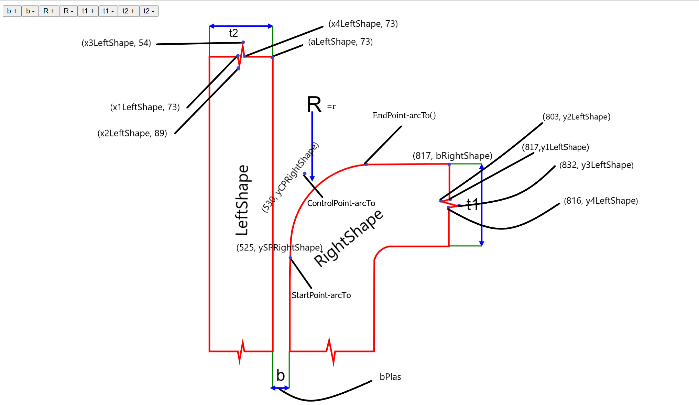

# React Konva

React Konva is a JavaScript library for drawing complex canvas graphics using [React](https://reactjs.org/)

# Steep-flanked single-V butt joint with backings Demo

# widened HY-butt Demo

